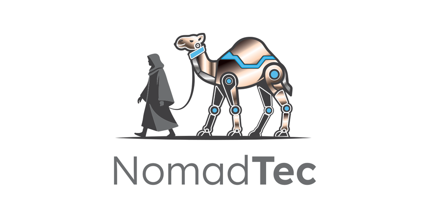
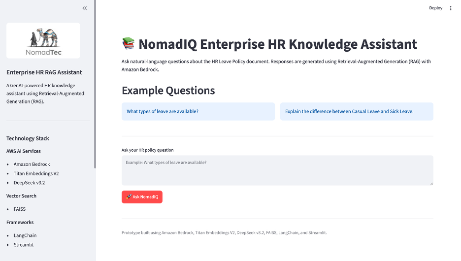
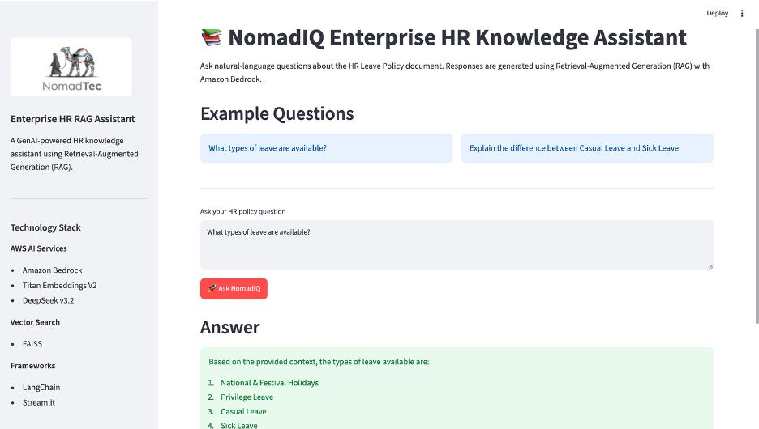
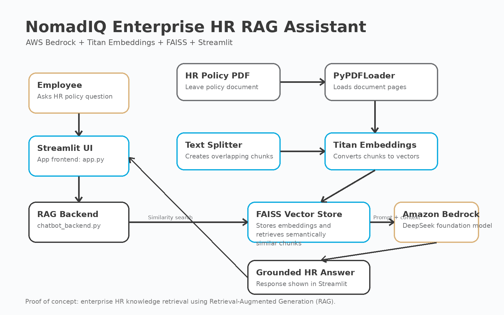

# NomadIQ Enterprise HR RAG Assistant



## Executive Summary

NomadIQ Enterprise HR RAG Assistant is a Generative AI proof of concept that enables employees to ask natural-language HR policy questions and receive grounded answers from official HR documentation.

The application uses Retrieval-Augmented Generation (RAG), Amazon Bedrock, Titan Embeddings V2, DeepSeek v3.2, FAISS, LangChain, and Streamlit.

---

## Application

### Home Page



---

### RAG Response Demo



---

### System Architecture



---

## Architecture


---

## Business Problem

Employees often spend time searching lengthy HR policy documents or contacting HR teams for routine questions.

This solution improves employee self-service by retrieving relevant policy content and generating clear answers from trusted HR documentation.

---

## Features

- PDF document ingestion
- Recursive text chunking
- Titan Embeddings V2
- FAISS semantic vector search
- Amazon Bedrock LLM response generation
- Streamlit web interface
- NomadTec branded UI
- Product requirements documentation
- Agile sprint backlog
- Architecture documentation

---

## Technology Stack

| Layer | Technology |
|---|---|
| Frontend | Streamlit |
| LLM | Amazon Bedrock + DeepSeek v3.2 |
| Embeddings | Amazon Titan Embeddings V2 |
| Vector Store | FAISS |
| Framework | LangChain |
| Language | Python |
| Documentation | Markdown |

---

## Example Questions

```text
What types of leave are available?
```

```text
Explain the difference between Casual Leave and Sick Leave.
```

---

## Project Structure

```text
NomadIQ-Enterprise-HR-RAG-Assistant/
│
├── app.py
├── chatbot_backend.py
├── requirements.txt
├── README.md
├── .gitignore
│
├── assets/
│   ├── nomadtec_logo.png
│   └── rag_architecture.png
│
├── data/
│   └── pdf/
│       └── Leave-Policy-India.pdf
│
├── docs/
│   ├── Product_Requirements.md
│   ├── Sprint_Backlog.md
│   └── Architecture.md
│
└── screenshots/
```

---

## Product Management Artifacts

This repository includes product and delivery documentation:

- [Product Requirements](docs/Product_Requirements.md)
- [System Architecture](docs/Architecture.md)
- [Sprint Backlog](docs/Sprint_Backlog.md)

---

## Future Enhancements

- Multi-document HR knowledge base
- Source citations
- Role-based access control
- Amazon OpenSearch Serverless
- Amazon Bedrock Knowledge Bases
- SSO authentication
- Conversation history
- Multi-region HR policy support
- Deployment to AWS

---

## Author

**Larry Dana Gaither**  
Senior AI Product Manager | AI Transformation | AWS Generative AI